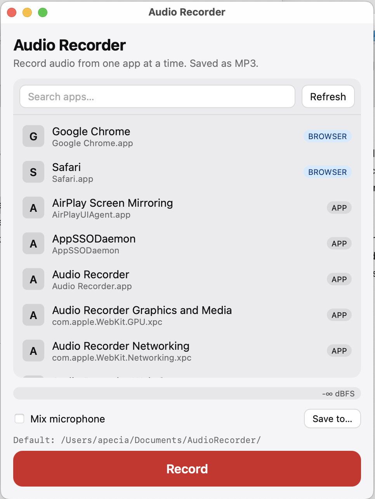

# Audio Recorder

🎙️ Apecia Audio Recorder is a free, open-source alternative to tools like Audio Hijack or Rogue Amoeba's Loopback. It is a high-performance desktop app for recording audio from your microphone and/or a specific running application (per-app audio) without capturing system-wide noise.

A cross-platform desktop app for recording audio from your **microphone** and/or a **specific running application**, saved as MP3. Built with [Tauri 2](https://tauri.app/) (Rust) and a [React](https://react.dev/) + TypeScript frontend.

Pick an app from the list (browser tab, meeting app, music player, etc.), optionally mix in your mic, hit record, and get an MP3 on disk.



---

## Features

- **Per-application audio capture** — record only the audio coming from a chosen running process, not the whole system.
- **Microphone capture** — record from the default input device.
- **Mic + app mixing** — capture both sources into a single mixed MP3 (e.g. for meeting + commentary recordings).
- **MP3 output** — encoded on the fly via `mp3lame-encoder`.
- **Live VU meter** — real-time audio level feedback while recording.
- **Process picker** — lists recordable processes with icons, grouped into browser / meeting app / other.
- **Permission gating** — detects and guides the user through Screen Recording / Microphone permissions (macOS).
- **System tray** — quick access without keeping a window open.
- **Configurable output location** — defaults to a per-user recordings folder, can be overridden per session.

## Platforms

| Platform | Status | Audio capture backend |
|----------|--------|------------------------|
| macOS 13+ | Supported | [`ScreenCaptureKit`](https://developer.apple.com/documentation/screencapturekit) (per-process audio) |
| Windows 10/11 | Supported | WASAPI / process loopback via the `windows` crate |

Microphone capture on both platforms uses [`cpal`](https://github.com/RustAudio/cpal).

## Repository layout

This repo contains two parallel Tauri projects — one tuned per OS — that share the same UI and command surface:

```
audio_recorder/
├── mac_/        # macOS build (ScreenCaptureKit per-process capture)
│   ├── src/             # React + TypeScript frontend
│   ├── src-tauri/       # Rust backend (Tauri commands, capture, encoder)
│   └── package.json
└── window_/     # Windows build (Win32 / WASAPI per-process loopback)
    ├── src/
    ├── src-tauri/
    └── package.json
```

Both projects expose the same Tauri commands and emit the same events, so the React frontend (`src/App.tsx`, `src/api.ts`, `src/components/*`) is effectively identical between them.

### Backend modules (`src-tauri/src/`)

- `commands.rs` — Tauri commands invoked from the UI (`list_recordable_processes`, `start_recording`, `stop_recording`, `check_permissions`, …).
- `capture/macos.rs` — ScreenCaptureKit per-process audio tap.
- `capture/windows.rs` — Windows process-loopback capture.
- `mic.rs` — microphone input via `cpal`.
- `mixer.rs` — sample-rate handling and mic/app mixing.
- `encoder.rs` — MP3 encoding (`mp3lame-encoder`) and file writing.
- `process_list.rs` — enumerates running processes and resolves display name / icon / category.
- `tray.rs` — system tray icon and menu.

### Frontend (`src/`)

- `App.tsx` — top-level layout, permission gate, event wiring.
- `api.ts` — typed wrapper around Tauri `invoke` / `listen`.
- `store.ts` — `zustand` store holding processes, recording status, levels, and banners.
- `components/ProcessList.tsx` — pick a source application.
- `components/RecordControls.tsx` — start / stop / mic-mix toggle.
- `components/VuMeter.tsx` — live level display.
- `components/PermissionGate.tsx` — onboarding when permissions are missing.

## Tech stack

- **Tauri 2** with plugins: `dialog`, `fs`, `opener`, `process`
- **Rust** — `cpal`, `screencapturekit` (macOS), `windows` crate (Windows), `mp3lame-encoder`, `ringbuf`, `crossbeam-channel`, `sysinfo`, `tracing`
- **React 18** + TypeScript, **Vite**, **zustand**

## Getting started

### Prerequisites

- **Node.js** 18+ and **npm**
- **Rust** stable (1.77+) — install via [rustup](https://rustup.rs/)
- **macOS**: Xcode Command Line Tools, macOS 13 (Ventura) or newer
- **Windows**: Visual Studio Build Tools with the "Desktop development with C++" workload, Windows 10/11

### Run in development

Choose the project for your OS:

```bash
# macOS
cd mac_
npm install
npm run tauri:dev

# Windows
cd window_
npm install
npm run tauri:dev
```

The Vite dev server runs on `http://localhost:1420`; Tauri launches the desktop window against it.

### Build a release bundle

```bash
npm run tauri:build
```

Output bundles land under `src-tauri/target/release/bundle/` (e.g. `.dmg` / `.app` on macOS, `.msi` / `.exe` on Windows).

### Useful scripts

| Command | Description |
|---------|-------------|
| `npm run dev` | Frontend-only Vite dev server |
| `npm run build` | Type-check + Vite production build |
| `npm run typecheck` | `tsc --noEmit` |
| `npm run tauri:dev` | Full Tauri dev (frontend + Rust backend) |
| `npm run tauri:build` | Production app bundle |

## Permissions

### macOS

The app needs:

- **Screen Recording** — required by ScreenCaptureKit to tap another app's audio (no video is captured).
- **Microphone** — only when mic capture / mic mix is enabled.

On first launch the app detects missing permissions and routes you through *System Settings → Privacy & Security*. Entitlements are declared in `src-tauri/entitlements.plist`.

### Windows

Standard user permissions are sufficient. Microphone access follows the Windows privacy settings for microphone-using apps.

## How it works

1. The frontend calls `list_recordable_processes`; the Rust side enumerates processes and returns display metadata.
2. User picks a process and (optionally) toggles **Mix microphone**.
3. `start_recording` spins up the platform capture backend, a mic stream if requested, and a mixer that pushes interleaved PCM into the MP3 encoder.
4. While recording, audio levels are emitted on the `audio-level` event for the VU meter; errors / warnings go through `recording-error` / `recording-warning`.
5. `stop_recording` flushes the encoder, closes the file, and returns the output path and duration.

Output files are written to the OS-appropriate recordings directory by default (overridable per session).

## License

Released under the [MIT License](LICENSE) — free forever, for any use (personal or commercial). No warranty.

```
MIT License

Copyright (c) 2026 Audio Recorder contributors

Permission is hereby granted, free of charge, to any person obtaining a copy
of this software and associated documentation files (the "Software"), to deal
in the Software without restriction, including without limitation the rights
to use, copy, modify, merge, publish, distribute, sublicense, and/or sell
copies of the Software, and to permit persons to whom the Software is
furnished to do so, subject to the following conditions:

The above copyright notice and this permission notice shall be included in all
copies or substantial portions of the Software.

THE SOFTWARE IS PROVIDED "AS IS", WITHOUT WARRANTY OF ANY KIND, EXPRESS OR
IMPLIED, INCLUDING BUT NOT LIMITED TO THE WARRANTIES OF MERCHANTABILITY,
FITNESS FOR A PARTICULAR PURPOSE AND NONINFRINGEMENT. IN NO EVENT SHALL THE
AUTHORS OR COPYRIGHT HOLDERS BE LIABLE FOR ANY CLAIM, DAMAGES OR OTHER
LIABILITY, WHETHER IN AN ACTION OF CONTRACT, TORT OR OTHERWISE, ARISING FROM,
OUT OF OR IN CONNECTION WITH THE SOFTWARE OR THE USE OR OTHER DEALINGS IN THE
SOFTWARE.
```
